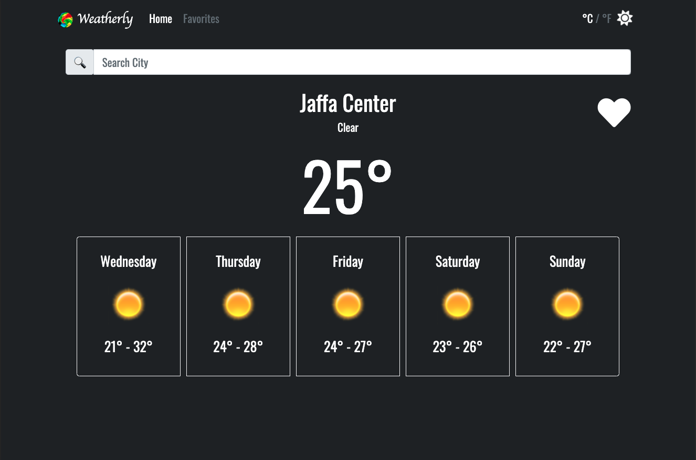
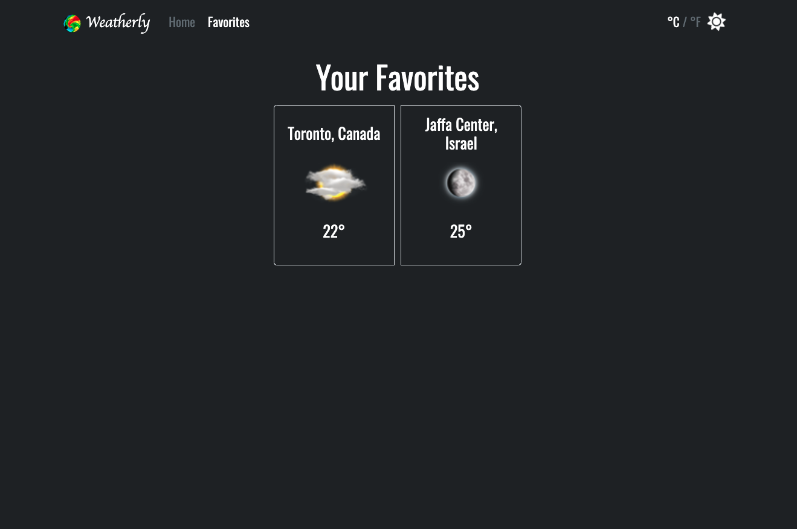
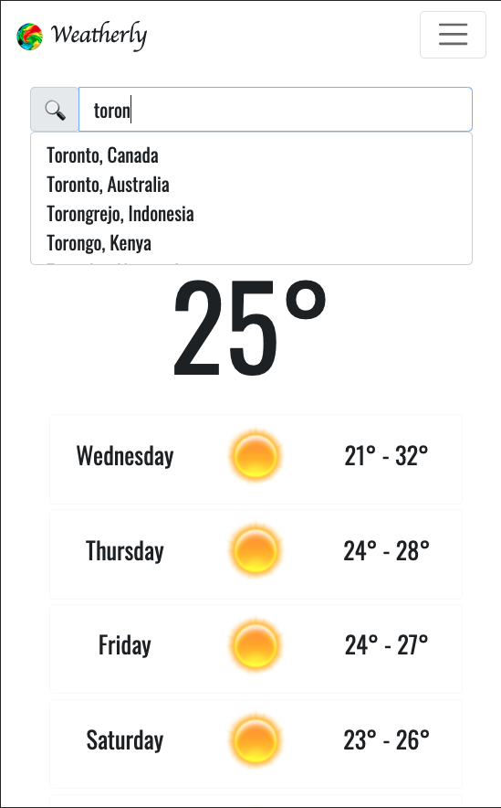
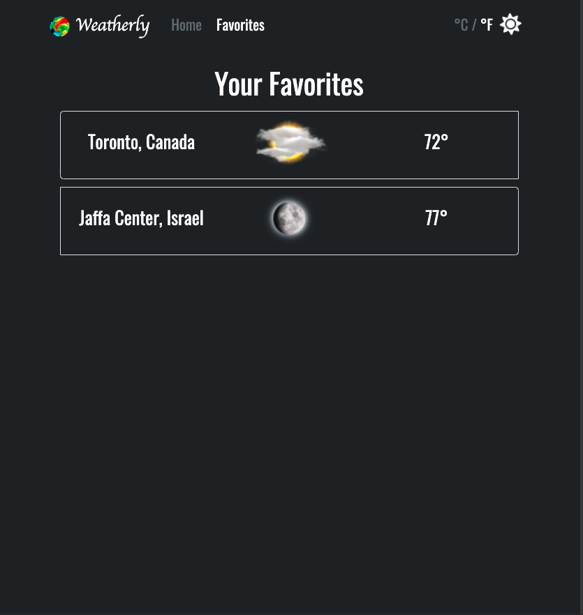

# Weatherly
**Because every decent app's name ends with a "ly" ;)**

Demo: [Weatherly](http://liorho.github.io/Lior-Hoshea-20-05-2020)

## Table Of Contents
- [Weatherly](#weatherly)
  - [Table Of Contents](#table-of-contents)
  - [Features](#Features)
  - [Running the project](#running-the-project)
  - [Screenshots](#screenshots)
  - [Tech Stack](#tech-stack)

## Features
1. Search for a city and get its current weather and a five day forecast
2. Autocomplete cities search
3. Show the weather in your current location by default
4. Mark cities as favorites
5. Choose a preferred theme (Dark/Light mode)
6. Choose a preferred temperature unit (Celsius/Fahrenheit)
7. Fully responsive
8. Weather is Provided by [AccuWeather](https://developer.accuweather.com/).

## Running the project

1. Clone the repo.
2. Run `npm install`.
3. Run `npm run dev`
4. Navigate to `http://localhost:3000`.

## Screenshots
1. Home:

2. Favorites:

3. Autocomplete:

4. Responsive:

 
 

## Tech-stack
1. React
2. Redux
3. Axios
4. React-Bootstrap

